# Vue.js tutorial
## Getting started

To be able to run the code, you first need to install the dependencies

If you're using *Visual Studio Code*, you can open a terminal window in your working directory from the navigation bar at the top, which will open it at the bottom of your window.

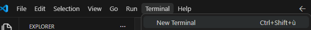

In the terminal, navigate to the `/frontend/`-directory if you aren't there already, and execute the following command:
```
npm install
```

To run the app, use the following command:
```
npm run dev
```

## Vue.js basics

Instead of writing separate `.html`, `.css`, or `.js` files, we will write `.vue`-files, which combines all 3 of these.

The typical structure of a `.vue` file is as follows:
```
<script setup>
    // here goes javascript code
</script>

<template>
    <!-- here goes html code -->
</template>

<style scoped>
    /* here goes css code */
</style>
```
The order of the 3 aspects doesn't really matter, and it's not mandatory to have all 3 in every `.vue`-file.

**We won't be using the \<style>\.\.\.\</style> part in this project, because Stitch decided to use something called "tailwind.css" for the css, and that works differently**

Despite what I said earlier, there still are a *couple* of `.html`, `.css`, or `.js` files present in the project tho:
- `index.html`: this is the "main" page of our application, but we don't have to write anything in that file ourselves: the contents of the `App.vue` file are loaded into this file
- `src/assets/main.css`: This is the main style sheet that all pages use. This will mostly load in the *Tailwind.css* stuff, but you can also add things here
- `*.config.js`: configuration files for vite, vitest, tailwind, etc
- `src/main.js`: This is the main JavaScript file that tells Vue which services to use
- `src/router/index.js`: This file will be used to navigate between the pages, I'll get back to this later

## Views and Components
In vue, a website is made up from **views** and **components**, these can be found in their respective folders in the `/src` folder:

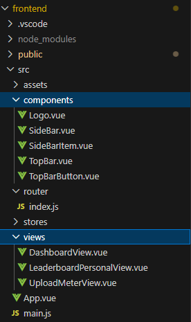

As you can see, I already made a couple of views and components, but not all (and the views aren't even done yet!)

The difference between a component and a view, is that a component is typically smaller, and will be used in multiple places in the website, while a view is basically a full webpage. You can use components inside views and other components. 

So for example: the topbar and sidebar are good choices for components, since those are present on every page. Further, the sidebar has a bunch of buttons with the same layout, so we can make a component of those buttons as well.

The advantage of turning code that is repeated accross multiple pages or within the same page into a component, is that if you want to change something about it, you only need to do so *once*, instead of having to look for it in every page it appears in.

I'll explain how these work using the ones I've made thus far, but first

### App.vue

This is the "main" `.vue`-file of our application, and it currently looks like this:

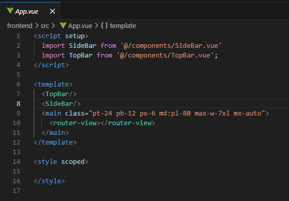

So, you can see that I use 2 components here, the `<TopBar/>` and the `<SideBar/>`, and I import those at the top in the `<script>`-section of the file.

Then I have a `<main>`-html-element, within which I have a vue-specific element `<router-view></router-view>`.

The top- and side-bars will be visible on all pages (come to think of it, this probably is bad since those shouldn't be there when not logged in yet..... that should be easy enough to fix later), while the "router-view"-element will show whatever the current **view** is. How this works I will explain in a later section, fist I'm gonna talk about how components and views work:

### the Topbar
This is what the topbar looks like at this moment:
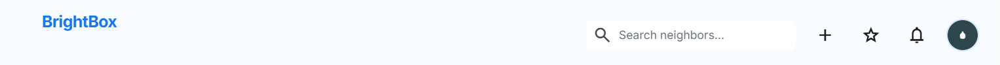

For the topbar, I copied the html code from the `Leaderboard-personal.html` file for the header (that stitch helpfully annotated as "TopAppBar as well") into the `template`-section of the `TopBar.Vue` file:

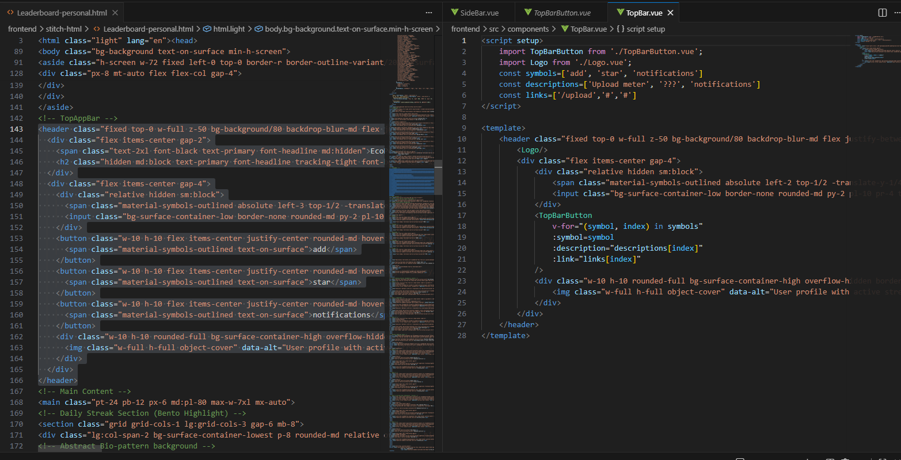

Within that html code, I noticed that there were 3 buttons with the exact same layout (the plus-, star-, and bell-buttons), so I removed that from my topbar-component into another component: `TopBarButton.vue`

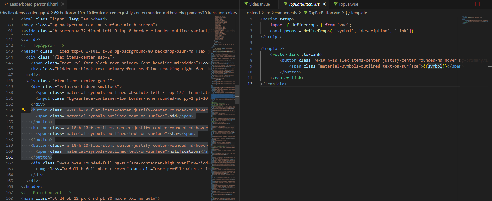

I'll now explain some of the aspects of components using the `TopBarButton.vue`:

In the script section of this file, you will see that I first import `defineProps`, and then create a constant `props` using this function, with a list of strings as the argument
```
<script setup>
    import { defineProps } from 'vue';
    const props = defineProps(['symbol', 'description', 'link'])
</script>
```
These are the **prop**erties of this component, which are essentially parameters that you can pass to the component. In this case, this component requires
- a symbol: this is what the button will show
- a description: this is a bit of text that becomes visible once you hover over the button with your mouse
- a link: this is where the page will navigate to when you press the button

You can access the values of these properties in 3 ways, depending on where you need them:
- in the `<script>` section, if you want the "symbol" property, you need to do `props.symbol`
- in the `<template>` section, if you are in between two html elements, you need to place it in between this {{ ... }}. So for example, if you want a div with the "symbol" property inside it, you write `<div> {{ symbol }} </div>`
- in the `<template>` section, if you want to use it *inside* an html element for an attribute, you need to put a ":" in front of the attribute. So for example, if you want to link to an image, you write `` or `` (I don't think it matters whether or not you add the quotes)

We can see some of this in action in the html-part of the TopBar component:
```
<template>
    <router-link :to=link>
        <button class="..." 
        :title="description">
            <span class="...">{{symbol}}</span>
        </button>
    </router-link>
</template>
```
We add the description to the button via `:title="description"`, and we display the symbol inside the span via `{{symbol}}`.

`<router-link> ... </router-link>` is something unique to Vue, and it's basically the equivalent of an `<a> ... </a>`, and it is used for navigation within the site. So instead of writing `<a href="..."> </a>`, we will write `<router-link :to=link> </router-link>`. I'll get back to the router in a few moments.

But let's first look at the TopBar-component itself to see how we use this TopBarButton-component

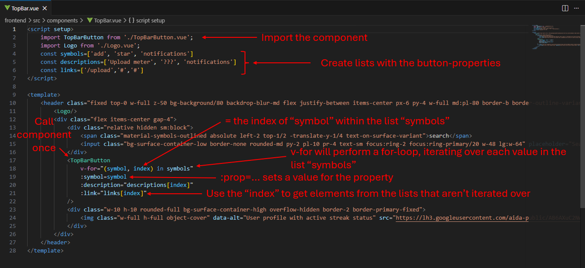

This is already a rather complex example, since we are both adding multiple copies of the component on the page via a for-loop (`v-for`) and filling in multiple properties (`:prop=value`). But I think it is quite easy to use once you understand what's happening: first you import the component, then instead of putting it in the code however many times you need it, you use a for-loop to place them automatically. In this case, the "symbols"-list has 3 elements, so it will add 3 buttons to the page. If we would want to remove one of the buttons or add one, we can simple remove or add their info to the lists, and vue will handle the rest.

For a simple component like the logo, it's just sufficient to first import it, and then write `<componentname/>` (see screenshot above at lines 3 and 11)

In `SideBar.vue`, I do a very similar thing, but there is an extra layer of complexity there: the button of the current page needs to light up:

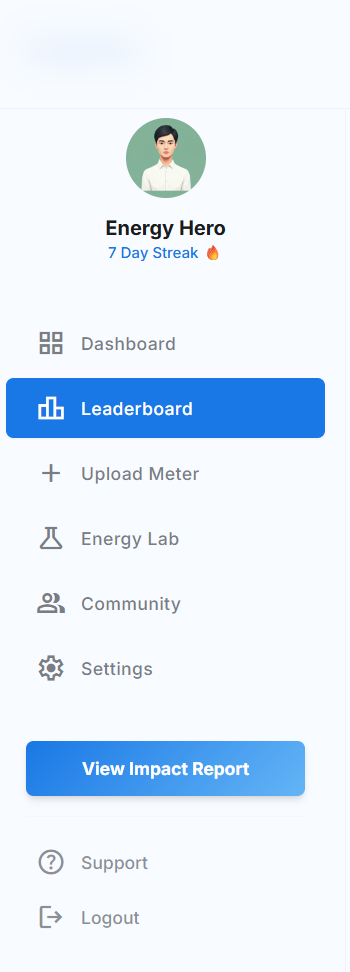

The way this is done is via an if-else statement, which looks similar to the `v-for`:

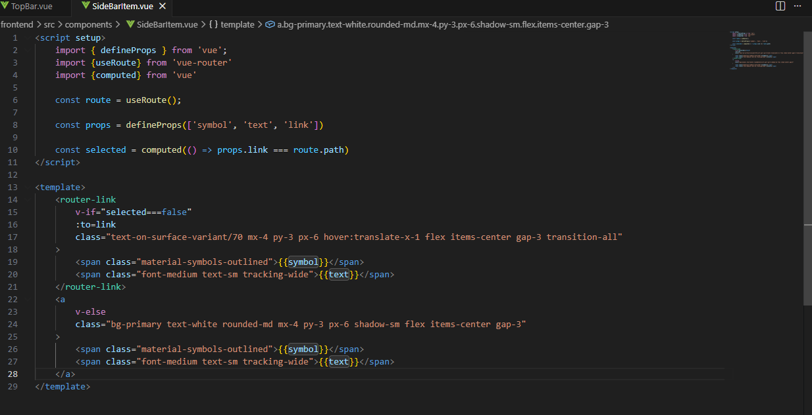

If the `selected`-variable equals `false`, the `<router-link>`-block gets rendered, and if it is `true`, then the `<a>`-block is executed.

There is one more thing related to this that might need explaining, namely `ref()` and `computed()`, which is what you'd use if you want to add some additional reactivity to the site, but this is getting kinda long and I still have some other stuff I need to explain (and I'm writing all this manually instead of just chatgpt-ing it for some reason), so idk, ask me about it or google it if you have need of it.

### making a view

I've quickly made 3 views thus farn and they very much aren't done yet, but they should serve just as an example so y'all can get started with turning other pages into views. There is a folder called `stitch-html`, which has the `.html` files that were generated by stitch. 

So to make a view, all you need to do is make an appropriately named `.vue`-file in the `src/views/` folder, open the `.html` file that you want to use as a base, look for where the `<main>`-html-element is, and copy everything **inside** of it to the `<template>`-section of the `.vue`-file. (Don't copy the `<main>`-element itself, since remember, we already put that in the `App.vue`-file)

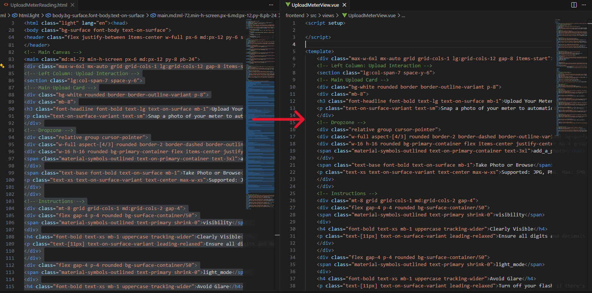

Like I said, other than separating the topbar and sidebar, I haven't done anything yet inside these views

### Using online components

There are several components you can find online, and it's pretty easy to plug those into our project. For example, on the dashboard-view, we need to have one or more graphs, and the way Stitch made those are not usable AT ALL. Instead, I'd recommend using something like this [https://primevue.org/chart/](https://primevue.org/chart/), which has a bunch of components for different types of charts. 

So whenever some element of your page looks kinda complicated, see if you can find a component online that already does what you need it do, and follow its steps to quickly and easily integrate it into our project. Don't write (or generate) everything yourself!

## Routing

This is how the internal navigation within a site works in vue (I alluded to this part a couple of times already). All routing is done by the `src/router/index.js` file, and it looks like this:

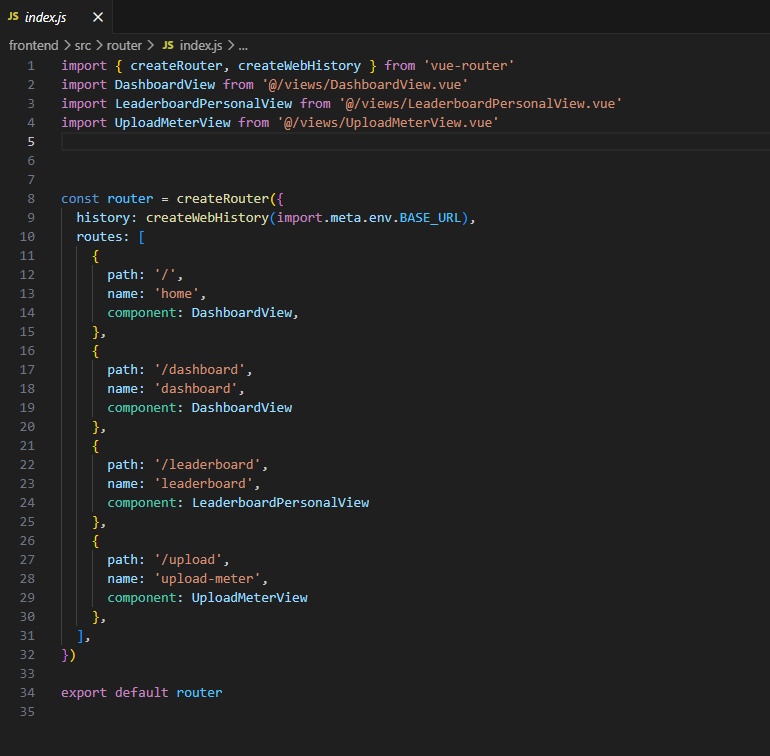

This basically has a list of all the different views, and what url you use to reach them: if you surf to `.../dashboard`, then the `<router-view></router-view>` element of the `App.vue`-file (see earlier) will load in and display the `DashboardView`-view. If you then go to `.../upload` instead, it will display the `UploadMeterView`, and so forth.

I think it's pretty self-explanatory as to how you add routes to this (don't ask me why it's called `component` where you need to fill in the name of the view, I have no idea)

The "path"-parameter is what you'll use in combination with `<router-link :to=path>` to traverse the website, like I did in the `TopBarButton.vue` and `SideBarItem.vue`

Note that if you were to make one of the main pages that needs a link in the sidebar, you'll need to go to `SideBar.vue` and fill those in into the "links"-list:

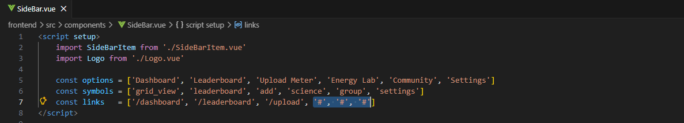

Alright, I think that's everything, if anything is unclear feel free to let me know!


